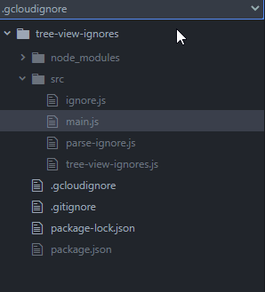

# tree-view-ignores

Tree-View Ignores allows showing more than just `.gitignore` files as being ignored in your `tree-view` of Pulsar.

This can help you visualize exactly how your source code will look to any number of supported ignore formats, and comes with a bonus feature that, unlike `tree-view`, your Git repository doesn't have to be initialized to start showing what's ignored.

Currently `tree-view-ignores` supports the following formats and features:

* `.gitignore`: Like `tree-view` will show any ignored files within the standard `.gitignore`
* `.gcloudignore`: Even supports `#!include:` syntax, and will import whatever files are defined.
* `.npmignore`: Supports the `.npmignore` file only, including the defaults applied by NPM
